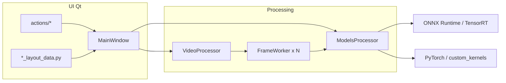

# Agent architecture — VisoMaster Fusion

Technical reference for **navigation and safe edits**. Short version at repo root: [`AGENTS.md`](../AGENTS.md).

## One-line view

A Qt window (`MainWindow`) holds control and parameter state; `VideoProcessor` orchestrates media read, pipelined detection, **per-GPU queues**, and workers; each `FrameWorker` runs the per-frame pipeline using sessions and tensors from `ModelsProcessor`.

## High-level flow

## Layers and responsibilities

### 1. `MainWindow` (`app/ui/main_ui.py`)

- Owns `video_processor`, `models_processor`, card dicts (target videos, input faces, embeddings).
- Connects Qt signals (VRAM, TRT build dialogs, etc.).
- **Very large**: new UI logic usually belongs in `app/ui/widgets/actions/` or a dedicated widget.

### 2. `VideoProcessor` (`app/processors/video_processor.py`)

- **QObject** with threads, queues (`frame_queue`, `frame_queues_by_gpu`), buffer limits, and `state_lock`.
- Handles playback, feeders, webcam/screen, segmented recording, virtual cam, playback audio, and multi-GPU policy.
- Constants and **allowlists** of controls that must be read **per frame** vs snapshot (`feeder_control`) — critical for live sliders.
- **Issue scan**: parallel pipeline with a control subset to diagnose detector/landmark/tracking.

### 3. `FrameWorker` (`app/processors/workers/frame_worker.py`)

- `threading.Thread` in two modes: **pool** (task queue) or **single frame** (preview).
- Full pipeline: detection, tracking, recognition, alignment, swap, masks, restorers, enhancers, editing, VR when applicable, optional metrics (`_PerfStageCollector`).
- **Multi-GPU**: pulls from the assigned GPU subqueue; in *hybrid* mode may **steal** work from other queues (`_fetch_task_with_stealing`).
- Depends on `main_window` for `control`, parameters, and `models_processor`.

### 4. `ModelsProcessor` (`app/processors/models_processor.py`)

- Central place for **device**, ORT provider (CUDA/CPU/TensorRT), model load/unload, VRAM cleanup.
- Aggregates domain subsystems: `FaceDetectors`, `FaceLandmarkDetectors`, `FaceSwappers`, `FaceRestorers`, `FaceMasks`, `FrameEnhancers`, `FaceEditors`, etc.
- **Isolated process** `_probe_onnx_model_worker`: builds TRT cache without killing the main process (VM/GPU failure history).
- Denylist `ONNX_MODELS_SKIP_TENSORRT_EP` for known incompatibilities (FP16, dynamic shapes, hangs).
- sRGB gamma: shared helpers with fallback if Kornia is missing.

### 5. Domain modules (`app/processors/`)

| Module | Role |
|--------|------|
| `face_detectors.py` | Detectors; optional ByteTrack |
| `face_landmark_detectors.py` | Multi-resolution facial landmarks |
| `face_swappers.py` | Inswapper, DFM, GhostFace, … |
| `face_restorers.py` | GFPGAN, GPEN, CodeFormer, REF-LDM, … |
| `face_masks.py` | Parsing, occlusion, XSeg mouth |
| `frame_enhancers.py` | Full-frame enhancement |
| `face_editors.py` / `face_reaging.py` | Expression / age editing |
| `frame_edits.py` | Frame adjustments not face-centric |
| `batched_detection_plan.py` | Batched detection planning |
| `gpu_scheduler.py` | **WeightedScheduler** (DRR), `GpuLoadMetrics`, weight calibration — **no Qt imports** |

### 6. UI: layouts and actions

- `*_layout_data.py`: control structure (IDs in `main_window.control`).
- `widget_components.py`: buttons, sliders, media/face cards.
- `actions/`: **control_actions**, **video_control_actions**, **save_load_actions**, **job_manager_actions**, **transcode_actions**, **gpu_settings_actions**, etc.

### 7. Models and data

- `models_data.py`: `models_dir` → `model_assets/`, model lists, ArcFace mappings, rules like `RESTORER_REQUIRED_CONTROL_SETTINGS`.
- Downloads: `download_models.py`, `app/helpers/downloader.py`.
- **REF-LDM / KV**: `app/processors/utils/ref_ldm_kv_embedding.py`.

### 8. `custom_kernels/`

PyTorch wrappers and benchmarks aligned with models; build scripts are project-specific. Treat as a **kernel library**, not the app flow.

### 9. `app/processors/external/`

Vendored code (YOLOX, partial CLIP, VR, …). **Excluded from mypy** in `pyproject.toml`; change only with strong reason.

## Core types (`app/helpers/typing_helper.py`)

- `ParametersTypes` / `FacesParametersTypes`: per-face parameters.
- `ControlTypes`: global control state.
- `MarkerTypes`: per frame index anchors with `parameters` + `control`.

## Multi-GPU and queues

- `VideoProcessor` rebuilds queues from load-balancing mode (`models_processor.load_balancing_mode` and related).
- `WeightedScheduler` assigns GPU targets deterministically (DRR).
- Workers with `assigned_gpu_index` **pin** the device for inference consistent with the queue.

## Preview and OpenGL

- Several `*_gl_item.py` and `preview_opengl_viewport_widget.py`; env vars such as `VISIOMASTER_PREVIEW_GL`, `VISIOMASTER_GL_DEBUG`, `VISIOMASTER_DEBUG_NIS` (see `graphics_view_actions.py`, NIS/FSR widgets).

## Tests

- `tests/unit/`: logic without GPU when possible.
- Markers `gpu`, `qt`, `integration`, `slow` — see `pyproject.toml`.
- Integration may require model files under `model_assets/`.

## Useful environment variables (debug / performance)

| Variable | Approximate purpose |
|----------|---------------------|
| `VISIOMASTER_PERF_BUNDLE` | Enables bundled performance flags |
| `VISIOMASTER_PERF_STAGES` | Per-stage timings in `FrameWorker` |
| `VISIOMASTER_PERF_LOG` / `VISIOMASTER_PERF_SWAP_CORE` | Extra granularity with bundle |
| `VISIOMASTER_PIPELINE_METRICS` | Queue depth / ORT stats |
| `VISIOMASTER_PERF_SEEK`, `VISIOMASTER_PERF_DISPLAY` | Seek / display performance |
| `VISIOMASTER_MULTI_GPU_LOG`, `VISIOMASTER_MULTI_GPU_ASSIGN_PER_WORKER` | Multi-GPU debugging |
| `VISIOMASTER_RECOG_CACHE_*` | Recognition cache thresholds |
| `VISIOMASTER_FEEDER_POST_DETECT_SYNC` | Explicit sync (debug only) |
| `VISIOMASTER_DISABLE_PINNED_H2D` | When set, skips pinned host staging for RGB HWC→CHW upload (see ``rgb_hwc_uint8_numpy_to_torch_chw`` in ``miscellaneous.py``). |
| `VISIOMASTER_TORCH_COMPILE` | Disable Inductor compile if boot fails |
| `VISIOMASTER_ORT_IOBINDING_POST_SYNC` | IOBinding post-sync behavior |
| `VISIOMASTER_TRT_NO_DYNAMIC_PROFILES` | Disables all ORT TRT EP ``trt_profile_*`` entries from ``tensorrt_dynamic_shape_profile_opts`` (plain TRT build). |
| `VISIOMASTER_LP_MOTION_TRT_STATIC_BATCH` | Omit **only** ``LivePortraitMotionExtractor`` dynamic batch profile (batch-1 engine cache). |
| `VISIOMASTER_TRT_MAX_BATCH_SWAP` / `VISIOMASTER_TRT_OPT_BATCH_SWAP` | Caps for Inswapper128 / GhostFace / HyperSwap batched I/O (default max 16, opt 4). |
| `VISIOMASTER_TRT_MAX_BATCH_LP_MOTION` / `VISIOMASTER_TRT_OPT_BATCH_LP_MOTION` | LivePortrait motion ``img`` profile (default max 8, opt 2). |
| `VISIOMASTER_TRT_MAX_BATCH_LP_STITCH` / `VISIOMASTER_TRT_OPT_BATCH_LP_STITCH` | Stitching / eye / lip ``input`` profile (defaults max 12, opt 4). |
| `VISIOMASTER_TRT_MAX_BATCH_ARCFACE` / `VISIOMASTER_TRT_OPT_BATCH_ARCFACE` | ``Inswapper128ArcFace`` ``input`` profile (defaults max 16, opt 8). |
| `VISIOMASTER_LOG_TRT_PROFILE` | Print merged min/opt/max shape lines when loading a model with a profile. |

**UI (PERF-005):** General settings → **Tune TensorRT dynamic batch profiles** — when enabled, sliders override the env defaults for the next TRT engine build (reload models). When disabled, only the ``VISIOMASTER_TRT_*`` variables above apply.

Implementation: ``app/processors/trt_dynamic_batch_profiles.py`` (merged from ``models_processor.load_model`` via ``merge_tensorrt_dynamic_shape_profiles``) for every ONNX load that uses TensorRT EP options.

Live list in code: search `VISIOMASTER_` under `app/`.

## Common risks when editing

1. **Blocking the GUI thread** with heavy ORT load or wrong CUDA sync.
2. **Desyncing** `control` from widgets (use `blockSignals` like existing patterns).
3. **Breaking TRT** when changing shapes or providers — check `ONNX_MODELS_SKIP_TENSORRT_EP` and the subprocess probe.
4. **Race conditions** between `VideoProcessor.state_lock`, queues, and Qt signals.

## Cross-references

- Model integration checklist: `docs/model_viability/INTEGRATION_CHECKLIST.md`
- User quick start: `docs/quickstart.md`
